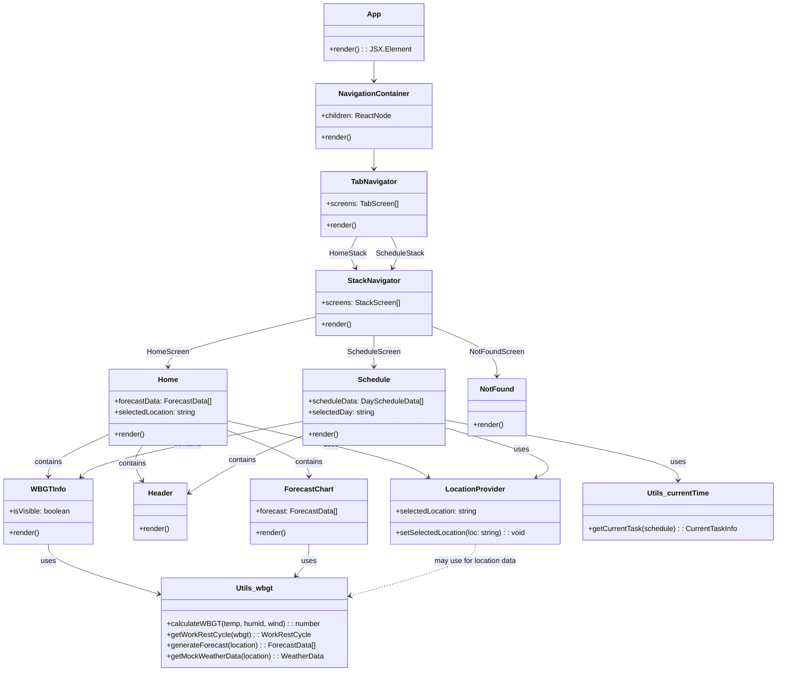

# Detailed Class Diagram

This Mermaid class diagram captures components, utilities and their relationships.

```mermaid
classDiagram
  class App {
    +render(): JSX.Element
  }
  class NavigationContainer {
    +children: ReactNode
    +render()
  }
  class TabNavigator {
    +screens: TabScreen[]
    +render()
  }
  class StackNavigator {
    +screens: StackScreen[]
    +render()
  }
  class Home {
    +forecastData: ForecastData[]
    +selectedLocation: string
    +render()
  }
  class Schedule {
    +scheduleData: DayScheduleData[]
    +selectedDay: string
    +render()
  }
  class NotFound {
    +render()
  }
  class LocationProvider {
    +selectedLocation: string
    +setSelectedLocation(loc: string): void
  }
  class Header {
    +render()
  }
  class WBGTInfo {
    +isVisible: boolean
    +render()
  }
  class ForecastChart {
    +forecast: ForecastData[]
    +render()
  }
  class Utils_wbgt {
    +calculateWBGT(temp, humid, wind): number
    +getWorkRestCycle(wbgt): WorkRestCycle
    +generateForecast(location): ForecastData[]
    +getMockWeatherData(location): WeatherData
  }
  class Utils_currentTime {
    +getCurrentTask(schedule): CurrentTaskInfo
  }

  App --> NavigationContainer
  NavigationContainer --> TabNavigator
  TabNavigator --> StackNavigator : HomeStack
  TabNavigator --> StackNavigator : ScheduleStack
  StackNavigator --> Home : HomeScreen
  StackNavigator --> Schedule : ScheduleScreen
  StackNavigator --> NotFound : NotFoundScreen
  Home --> LocationProvider : uses
  Schedule --> LocationProvider : uses
  Home --> Header : contains
  Schedule --> Header : contains
  Home --> WBGTInfo : contains
  Home --> ForecastChart : contains
  Schedule --> WBGTInfo : contains
  WBGTInfo --> Utils_wbgt : uses
  ForecastChart --> Utils_wbgt : uses
  Schedule --> Utils_currentTime : uses
  LocationProvider ..> Utils_wbgt : may use for location data
```
