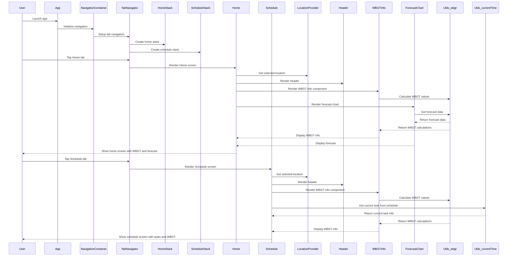

# Interaction Diagram

The following Mermaid sequence diagram shows the flow of user interactions through the application components.

```mermaid
sequenceDiagram
  participant User
  participant App
  participant NavigationContainer
  participant TabNavigator
  participant HomeStack
  participant ScheduleStack
  participant Home
  participant Schedule
  participant LocationProvider
  participant Header
  participant WBGTInfo
  participant ForecastChart
  participant Utils_wbgt
  participant Utils_currentTime

  User->>App: Launch app
  App->>NavigationContainer: Initialize navigation
  NavigationContainer->>TabNavigator: Setup tab navigation
  TabNavigator->>HomeStack: Create home stack
  TabNavigator->>ScheduleStack: Create schedule stack

  User->>TabNavigator: Tap Home tab
  TabNavigator->>Home: Render Home screen
  Home->>LocationProvider: Get selected location
  Home->>Header: Render header
  Home->>WBGTInfo: Render WBGT info component
  WBGTInfo->>Utils_wbgt: Calculate WBGT values
  Home->>ForecastChart: Render forecast chart
  ForecastChart->>Utils_wbgt: Get forecast data
  Utils_wbgt-->>ForecastChart: Return forecast data
  Utils_wbgt-->>WBGTInfo: Return WBGT calculations
  WBGTInfo-->>Home: Display WBGT info
  ForecastChart-->>Home: Display forecast
  Home-->>User: Show home screen with WBGT and forecast

  User->>TabNavigator: Tap Schedule tab
  TabNavigator->>Schedule: Render Schedule screen
  Schedule->>LocationProvider: Get selected location
  Schedule->>Header: Render header
  Schedule->>WBGTInfo: Render WBGT info component
  WBGTInfo->>Utils_wbgt: Calculate WBGT values
  Schedule->>Utils_currentTime: Get current task from schedule
  Utils_currentTime-->>Schedule: Return current task info
  Utils_wbgt-->>WBGTInfo: Return WBGT calculations
  WBGTInfo-->>Schedule: Display WBGT info
  Schedule-->>User: Show schedule screen with tasks and WBGT
```
